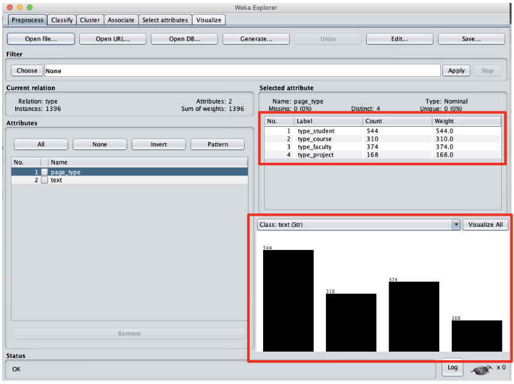
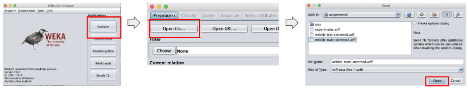
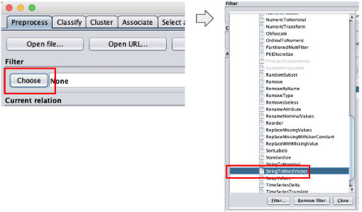
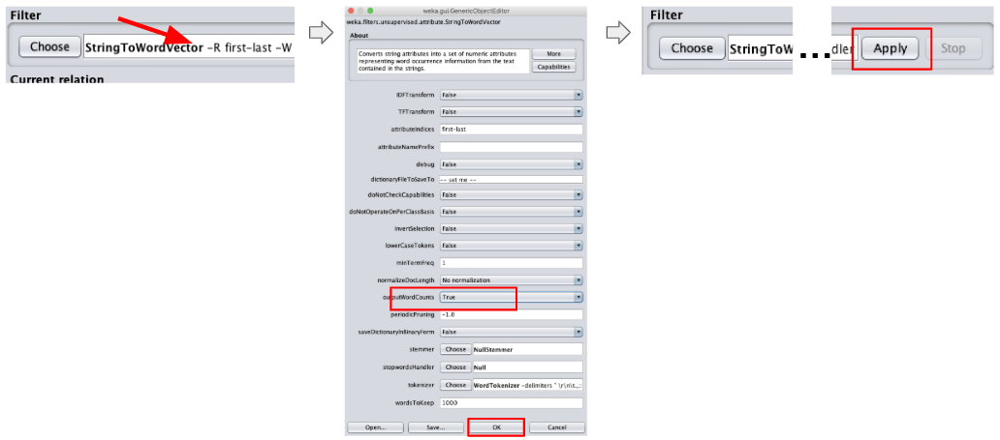
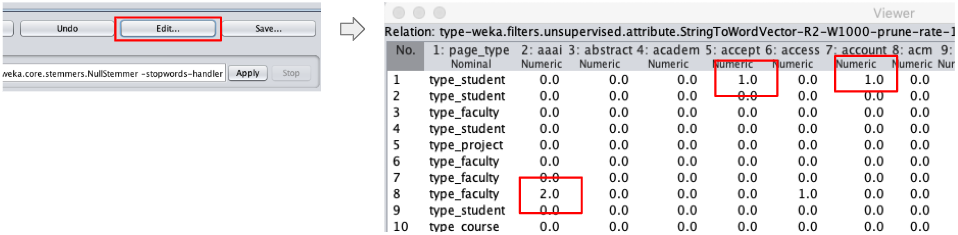
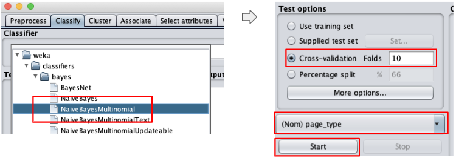

# Assignment 2

CTO-6930 Natural Language Processing, Spring 2019
Assignment 2
Christian Garbin

Document classification using [Weka](https://www.cs.waikato.ac.nz/ml/weka/).

## Report summary

TODO: summarize the report contents and results

## Assignment details

> Use Naïve Bayes and SVM in Weka to conduct text classification and return
> the classification accuracy.

Input data:

> WebKB containing 2803 training text data and 1396 test data. This data set
> contains WWW-pages collected from computer science departments of various
> universities. These web pages are classified into 4 categories: student,
> faculty, project, and course. The data set has been preprocessed with
> removing stop words and stemming. So you only need to count the word
> frequency to generate a document-word matrix before you start classification.

## Step 1 - Preprocessing the data

The goal of the preprocessing step is to transform the data from its current
format to a format that the classification/analysis tool expects.

In this case we need to transform the space-separated text file into an
[ARFF](https://www.cs.waikato.ac.nz/ml/weka/arff.html) file.

Below is an example of the input file. Each line represents a document. The
first word in each line is the document class, followed by tab, then followed
by the document. The document is already tokenized and stemmed, each word
separated by a space. Stop words have already been removed.

    student	brian comput scienc depart ... advisor david wood tabl content  ...
    faculty	russel ... california san diego jolla offic appli physic mathemat ...

The transformed file looks like this:

    @relation type

    @attribute page_type {type_student,type_course,type_faculty,type_project}
    @attribute text String

    @data
    type_student, 'brian comput scienc depart ... advisor david wood tabl ...'
    type_faculty, 'russel ... california san diego jolla offic appli physic ...'

The notable features of the new format are:

1. A header that specifies the format of the lines. In this case the format of
   each line is the class, followed by the document.
2. Each document is still a line, but the class and the content of the document
   are separated from each other, as different attributes (the document is in
   single quotes).

Note that the attribute starts with the prefix `type_`. This was done because
Weka's classifiers (at least some of them) expect the attribute name to be
unique, i.e. to not appear as part of the document itself.

This is the error that Weka shows if we don't add the `type_` prefix:

TODO: add example of this error.

Although Weka has is capable of transforming data, we decided to transform the
data using a Python script, mainly because of familiarity with Python and how
easy it is to perform these text transformations using it. The python script is
shown in [this appendix section](#python-script-for-text-to-arff-transformation).

To execute the script:

    python3 toarff.py input-file.txt > output-file.arff

Run the script in the train and test dataset files.

At this point we should have two ARFF files, one for the train dataset and one
for the test data set, ready to load in Weka.

## Step 2 - Inspecting the train dataset

In this section we will inspect the train dataset using Weka. The goals are to
have a general understanding of the datset and to check if there are problems
with that could affect training and evaluation.

A possible problem is class imbalance within each dataset (train and test) and
across them. Ideally the classes should be balanced within and across the
datasets.

To load and inspect in Weka:

1. Choose the Explorer option
2. Open the train dataset

In the picture above we can see that the dataset is imbalanced. The `student`
class has more samples than the other classes. In this case we should expect
to have more students since they outnumber faculty in real life by an order of
magnitude or more. This imbalance within the dataset is not a problem in this
case.

Note that at this point the data shows only two pieces of data, the class and
the text. All words from the document are under "text". In a later step we
will parse the document to extract words.

## Step 3 - Inspecting the test dataset

In this step we will repeat what was done for the train data (above), now with
the test data.

Following the same steps to start the Explorer and open the file results in
the picture below.

As in the train dataset, the test dataset is also imbalanced, but it is also
expected, for the same reasons dicussed for the train dataset.

## Step 4 - Analyzing the datasets

The imbalance within each dataset is not a concern in this case. The classes
are imbalanced within each dataset because of the nature of the data. A
university has more students than any other class, likely by an order of
magnitude.

More important is a possible imbalance across the datasets. The train and test
datasets must have the same proportion of classes or the accuracy tests will
not give a true measure of the model's accuracy with real-life data.

Checking the proportion of classes across the datasets:

| Train dataset   | Test dataset   |
| --------------- | -------------- |
| 1097/2083 = 39% | 544/1396 = 39% |
| 620/2083 = 22%  | 310/1396 = 22% |
| 750/2083 = 27%  | 374/1396 = 27% |
| 336/2083 = 12%  | 168/1396 = 12% |

The table shows that classes are equally represented in the train and test
datasets. Therefore we have a representative test dataset, one that will give
us confidence in the model evaluation.

## Step 5 - Creating the train dataset document-word matrix

The document-word matrix ([or document-term matrix](https://en.wikipedia.org/wiki/Document-term_matrix))
shows the frequency of words in each document (in our example, the frequency of
words in each line, since each line represents a document).

To create the matrix we need to:

1. Load the dataset
1. Apply the `StringToWordVector` filter with the `outputWordCounts` parameter
   set to `True`

Starting with loading the dataset.

Now that the dataset is loaded we apply the `StringToWordVector` filter with
the attribute `outputWordCounts` set to `True`. When this attribute is not set
we get a binary value (present/not present) only.

First we set the filter.

Then we configure the parameters we need and apply the filter. To configure the
filter, click anywhere in the white textbox with the filter name and its
parameters to bring up the configuration window for that filter. Once
configured, click on `Apply`.

**IMPORTANT:** Weka applies a filter on the current state of the dataset. If
you apply a filter, then change its configuration and apply it again, it will
not apply to the original dataset. It will apply on top of the results from the
last filter used. If you want to apply to the original dataset, either reload
the dataset or press the `Undo` button until the dataset is restored to its
original state.

Weka creates the matrix once the document is parsed. To see the table, press
the `Edit` button. The numbers are the count of words in each document (each
line of the test file in our case).

## Step 6 - Classifying and fine-tuning with a Naive Bayes classifier

The starting point for this section is the a loaded and filtered test dataset.
If you have not loaded a test dataset yet, please follow the instructions
[in this section](#step-5---creating-the-train-dataset-document-word-matrix).

### Classifying with a Naive Bayes classifier

We will use a multinomial naive Bayes classifier because it "is the event
model typically used for document classification, with events representing the
occurrence of a word in a single document" ((source)[https://en.wikipedia.org/wiki/Naive_Bayes_classifier#Multinomial_naive_Bayes]).

1. Choose the `NaivesBayesMultinomial` classifier.
1. Select cross-validation.
1. Select the `type` field (called `page_type` in Weka) as the attribute to
   classify on.
1. Click on the `Start` button.

This will result in about 81.8% accuracy:

    Correctly Classified Instances        2292               81.7695 %
    Incorrectly Classified Instances       511               18.2305 %

From the confusion matrix we can see where the classifier is making mistakes:

       a   b   c   d   <-- classified as
     979  15  74  29 |   a = type_student
      16 568  18  18 |   b = type_course
     185   7 491  67 |   c = type_faculty
      48   6  28 254 |   d = type_project

The `faculty` class is a source of several errors. A significant amount of its
documents are being classified as `student`.

### Fine-tuning a Naive Bayes classifier

In this section we will attempt to improve the performance of the classifiers
by fine-tuning applicable parameters.

An important concept in this section: all fine-tuning exercises are done on the
training data, using cross-validation to check the improvements. We must not
use the test data to for fine-tuning.

### Choosing words to keep

A key attribute of `StringToWordVector` is `-W`, the number of words to keep.

In [this discussion in Weka's forum](http://weka.8497.n7.nabble.com/StringToWordVector-W-option-td940.html)
it is explained that the number of words is kept per class:

> Additionally, if a class attribute is set, then you get the
> most common words per class, i.e. top 1000 for class A, plus top 1000
> for class B, and so on. Furthermore, in case of ties all words with the
> same count are included, which means that usually you will end up with
> 1000odd attributes, instead of exactly 1000

Since the corpus in this exercise is not large and we have a class definition,
it appears that 1,000 words per class (as explained above) would suffice.

To verify that we will double the number of words to keep and try the
classifiers again.

TODO: pic setting the words to keep

### Selecting attributes

TODO: select attributes with AttributeSelection - DO NOT use test data, must
use cross-validation at this stage.

See note in https://stackoverflow.com/questions/19192823/words-to-keep-attribute-in-stringtowordvector-filter-in-weka
that attribute selection should be used for supervised problem - which is the case here.

## Step 7 - Classifying and fine-tuning with an SVM classifier

### Classifying with the SVM classifier

### Fine-tuning an SVM classifier

## Step 8 - Reporting the fine-tuned classifier

TODO: final results using test data

## Apendix

### Python script for text to ARFF transformation

TODO: add Python script here.
