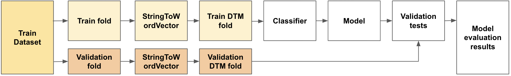
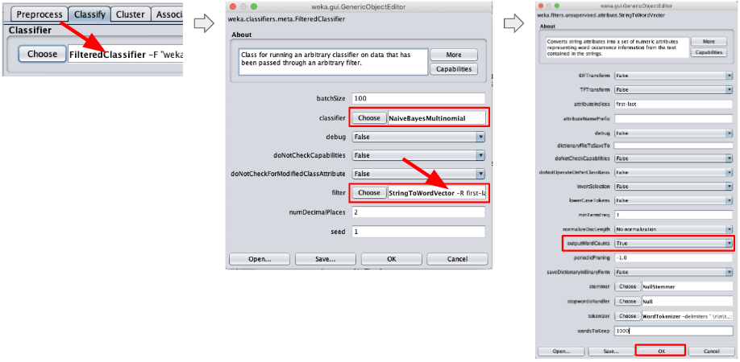
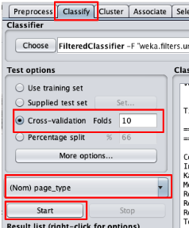
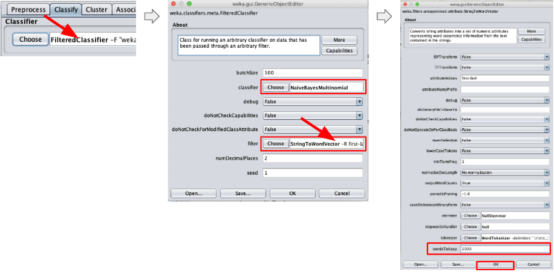
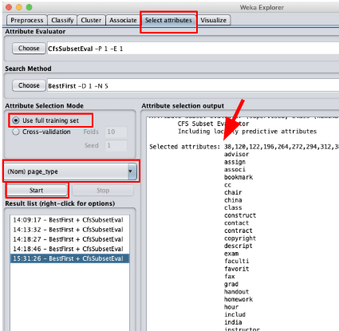
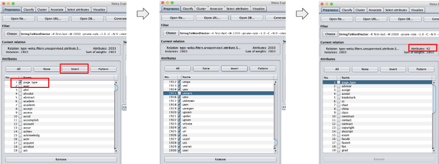
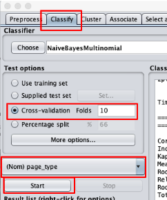

# Assignment 2

CTO-6930 Natural Language Processing, Spring 2019
Assignment 2
Christian Garbin

Document classification using [Weka](https://www.cs.waikato.ac.nz/ml/weka/).

## Report summary

TODO: summarize the report contents and results

## Assignment details

> Use Naïve Bayes and SVM in Weka to conduct text classification and return
> the classification accuracy.

Input data:

> WebKB containing 2803 training text data and 1396 test data. This data set
> contains WWW-pages collected from computer science departments of various
> universities. These web pages are classified into 4 categories: student,
> faculty, project, and course. The data set has been preprocessed with
> removing stop words and stemming. So you only need to count the word
> frequency to generate a document-word matrix before you start classification.

## Step 1 - Preprocessing the data

The goal of the preprocessing step is to transform the data from its current
format to a format that the classification/analysis tool expects.

In this case we need to transform the space-separated text file into an
[ARFF](https://www.cs.waikato.ac.nz/ml/weka/arff.html) file.

Below is an example of the input file. Each line represents a document. The
first word in each line is the document class, followed by tab, then followed
by the document. The document is already tokenized and stemmed, each word
separated by a space. Stop words have already been removed.

    student	brian comput scienc depart ... advisor david wood tabl content  ...
    faculty	russel ... california san diego jolla offic appli physic mathemat ...

The transformed file looks like this:

    @relation type

    @attribute page_type {type_student,type_course,type_faculty,type_project}
    @attribute text String

    @data
    type_student, 'brian comput scienc depart ... advisor david wood tabl ...'
    type_faculty, 'russel ... california san diego jolla offic appli physic ...'

The notable features of the new format are:

1. A header that specifies the format of the lines. In this case the format of
   each line is the class, followed by the document.
2. Each document is still a line, but the class and the content of the document
   are separated from each other, as different attributes (the document is in
   single quotes).

Note that the attribute starts with the prefix `type_`. This was done because
Weka's classifiers (at least some of them) expect the attribute name to be
unique, i.e. to not appear as part of the document itself.

This is the error that Weka shows if we don't add the `type_` prefix:

TODO: add example of this error.

Although Weka has is capable of transforming data, we decided to transform the
data using a Python script, mainly because of familiarity with Python and how
easy it is to perform these text transformations using it. The python script is
shown in [this appendix section](#python-script-for-text-to-arff-transformation).

To execute the script:

    python3 toarff.py input-file.txt > output-file.arff

Run the script in the train and test dataset files.

At this point we should have two ARFF files, one for the train dataset and one
for the test data set, ready to load in Weka.

## Step 2 - Inspecting the train dataset

In this section we will inspect the train dataset using Weka. The goals are to
have a general understanding of the datset and to check if there are problems
with that could affect training and evaluation.

A possible problem is class imbalance. Within a dataset each class should be
as frequent as they are in the real data. For example, if class A is twice as
frequent as class B in the real data, then the train and test data set should
have twice as many samples of A than B. Across the datasets the class should
have the same frequency. For example, if class A occurss twice as frequently
as other classes in the train dataset, it should also occur twice as
frequenlty in the test dataset. This is taken care of by balancing classes
within the datasets.

To load and inspect in Weka:

1. Choose the Explorer option
2. Open the train dataset

In the picture above we can see that the dataset is imbalanced. The `student`
class has more samples than the other classes. In this case we should expect
to have more students since they outnumber faculty in real life by an order of
magnitude or more. This imbalance within the dataset is not a problem in this
case.

Note that at this point the data shows only two pieces of data, the class and
the text. All words from the document are under "text". In a later step we
will parse the document to extract words.

## Step 3 - Inspecting the test dataset

In this step we will repeat what was done for the train data (above), now with
the test data.

Following the same steps to start the Explorer and open the file results in
the picture below.

As in the train dataset, the test dataset is also imbalanced, but it is also
expected, for the same reasons dicussed for the train dataset.

## Step 4 - Analyzing the datasets

The imbalance within each dataset is not a concern in this case. The classes
are imbalanced within each dataset because of the nature of the data. A
university has more students than any other class, likely by an order of
magnitude.

More important is a possible imbalance across the datasets. The train and test
datasets must have the same proportion of classes or the accuracy tests will
not give a true measure of the model's accuracy with real-life data.

Checking the proportion of classes across the datasets:

| Train dataset   | Test dataset   |
| --------------- | -------------- |
| 1097/2083 = 39% | 544/1396 = 39% |
| 620/2083 = 22%  | 310/1396 = 22% |
| 750/2083 = 27%  | 374/1396 = 27% |
| 336/2083 = 12%  | 168/1396 = 12% |

The table shows that classes are equally represented in the train and test
datasets. Therefore we have a representative test dataset, one that will give
us confidence in the model evaluation.

## Step 5 - Creating the train dataset document-word matrix

The document-word matrix ([or document-term matrix](https://en.wikipedia.org/wiki/Document-term_matrix))
shows the frequency of words in each document (in our example, the frequency of
words in each line, since each line represents a document).

To create the matrix we need to:

1. Load the dataset
1. Apply the `StringToWordVector` filter with the `outputWordCounts` parameter
   set to `True`

Starting with loading the dataset.

Now that the dataset is loaded we apply the `StringToWordVector` filter with
the attribute `outputWordCounts` set to `True`. When this attribute is not set
we get a binary value (present/not present) only.

First we set the filter.

After we configure the parameters we need and apply the filter. To configure
the filter, click anywhere in the white textbox with the filter name and its
parameters to bring up the configuration window for that filter. Once
configured, click on `Apply`.

**IMPORTANT:** Weka applies a filter on the current state of the dataset. If
you apply a filter, then change its configuration and apply it again, it will
not apply to the original dataset. It will apply on top of the results from the
last filter used. If you want to apply to the original dataset, either reload
the dataset or press the `Undo` button until the dataset is restored to its
original state.

Weka creates the matrix once the document is parsed. To see the table, press
the `Edit` button. The numbers are the count of words in each document (each
line of the test file in our case).

## Step 6 - Classifying and fine-tuning with a Naive Bayes classifier

Before starting the fine-tuning process we will review two concepts that guide
that process.

### Preserving the test dataset

An **important optimization concept**: all fine-tuning exercises are verified
with cross-validation to check the improvements (or a validation set, but we
do not have one in this case, so we fall back to cross-validation).

We must not use the test data for fine-tuning. It must be used only for the
final validation of the tuned model. "Otherwise, the very real danger is that
you may tune your hyperparameters to work well on the test set, but if you were
to deploy your model you could see a significantly reduced performance."
([source](http://cs231n.github.io/classification/#val) - see more details in
that page).

### Splitting the train dataset before creating document-term matrices

Although we created a document-term matrix as a separate step above, using the
`Preprocess` tab, when fine-tuning a classifier with cross-validation we need
to apply the filters as part of the classification process itself, not as a
separate step in the process.

With cross-validation we split the train set into a train fold and a validation
fold, train the classifier with the train fold, then check the results on the
validation fold. These steps are repeated for the number of folds we chose.

If we apply the filter as a separate preprocess step, the train/validate
process looks like this:

The separate preprocess step creates one document-term matrix from the complete
train dataset. Once we split it into the train and validation folds, the train
fold contains information on the complete train dataset, including information
that will be part of the validation fold when we split the dataset for cross-
validation. In other words, the classifier can "peek" into the validation data
during training.

The result is a validation step that produces optimistic results. The
classifier will look good during validation, but only because it was able to
access too much information. When testing with the actual test dataset it will
not perform as well.

What kind of information are we sharing that we should not? Any information
that is created using the entire dataset. The typical example is tf-idf. It
uses the number of documents as part of its formula.

In other cases, when we do not use the entire dataset for calculations, we may
get away with creating the document-term matrix with the complete train
dataset. However, starting with splitting the train dataset first, then
creating the separate document-term matrix is a better practice that will
avoid errors down the road, as we run more experiments.

Applying filter and classification together looks like the picture below. The
major difference is that first we split the original dataset into a train and a
validation fold, then create the document-term matrix for each of them
separately. Now the classifier only "sees" data that are part of the train
fold.

### Classifying with a Naive Bayes classifier

We will use a multinomial naive Bayes classifier because it "is the event
model typically used for document classification, with events representing the
occurrence of a word in a single document" ([source](https://en.wikipedia.org/wiki/Naive_Bayes_classifier#Multinomial_naive_Bayes)).

As explained in the previous section, we will split the train dataset before
we create the document-term matrix. To do that we need to apply the
`StringToWordVector` filter before the classifier, using Weka's meta classifier
`FilteredClassifier` in the `Classify` tab.

Click on any part of the `Classifier` textbox to bring up the configuration
window. It has a field for `classifier` and a field for `filter`. Choose the
`NaiveBayesMultinomial` for `classifier` and `StringToWordVector` for `filter`.
Then click anywhere in `StringToWordVector` textbox to brig up its
configuration window and choose `True` for `outputWordCounts`.

Now we are ready to start the classification and cross-validation. Back in
`Classify` tab:

1. Select cross-validation.
1. Select the `type` field (called `page_type` in Weka) as the attribute to
   classify on.
1. Click on the `Start` button.

This will result in about 82.7% accuracy.

    Correctly Classified Instances        2317               82.6614 %
    Incorrectly Classified Instances       486               17.3386 %

From the confusion matrix we can see where the classifier is making mistakes:

       a   b   c   d   <-- classified as
     991  16  62  28 |   a = type_student
      12 576  16  16 |   b = type_course
     174   8 499  69 |   c = type_faculty
      49   8  28 251 |   d = type_project

The `faculty` class is a source of several errors. A significant amount of its
documents are being classified as `student`.

### Fine-tuning a Naive Bayes classifier

In this section we will attempt to improve the performance of the classifiers
by fine-tuning applicable parameters.

We still keep using cross-validation in this stage, not the test dataset, as
explain [in this section](#preserving-the-test-dataset).

#### Choosing words to keep

A key attribute of `StringToWordVector` filter is `-W`, the number of words to
keep.

In [this discussion in Weka's forum](http://weka.8497.n7.nabble.com/StringToWordVector-W-option-td940.html)
it is explained that the number of words is kept per class.

> Additionally, if a class attribute is set, then you get the
> most common words per class, i.e. top 1000 for class A, plus top 1000
> for class B, and so on. Furthermore, in case of ties all words with the
> same count are included, which means that usually you will end up with
> 1000odd attributes, instead of exactly 1000

Since the corpus in this exercise is not large and we have a class definition,
it appears that 1,000 words per class (as explained above) would suffice. To
verify that we will double the number of words to keep and try the
classifiers again.

First we will change the filter, then run the classifier again.

Click on the `FilteredClassifier` textbox, then on the `StringToWordVector`
textbox, change `wordsToKeep` to 2000, click `OK` to save the changes.

With the new filter is applied we can run the classifier again. Verify that it
is configured correctly, then click on `Start` to run the classifier.

It improved, but not by much.

    Correctly Classified Instances        2325               82.9468 %
    Incorrectly Classified Instances       478               17.0532 %

The confusion matrix shows that accuray for each class (true positive)
improved, with the excpetion of a decline for `project`.

       a   b   c   d   <-- classified as
     994  14  61  28 |   a = type_student
      12 579  15  14 |   b = type_course
     165  10 506  69 |   c = type_faculty
      46   7  37 246 |   d = type_project

#### Selecting attributes

Out of all 2,000 attributes (words in the document) we now have selected, some
carry more information than others, i.e. they are more predictive than others.

We will use Weka's attribute selection feature to find these attributes and use
them to attempt to improve the classifier.

Go to the `Select attribute` tab, select the `type` attribute and click on
`start` to get a list of selected attributes. These are the attributes with the
most predictive power.

We will now use only these attributes with the classifier.

The first step is to remove all attributes that are not part of the selected
attributes list.

Since we will reduce the number of attributes by a large amount, we need to be
extra careful that we are selecting the correct attributes to keep. Even one
mistake in this step will significantly change the results.

To make the removal of attributes easier, we will first select the ones to keep
then invert that selection. There are much fewer attributes to keep. Inverting
the selection is faster than selecting the attributes to remove first.

1. Go to the `Preprocess` tab
1. Select the class atrtibute, the very first one in the list. It is not part
   of the selected attribute list, but we need it to perform the classification.
1. Select each attribute in the list. Use the attribute numbers to help
   select them.
1. Click on `Invert` and `Apply` (in the filter line).

At this point we should be left with the number of attributes selected, plus
one for the class attribute. Check that the number matches what we expect.

Now we can run the classifer again. Check that it is configured correctly and
click on `Start`.

This version has a significantly better accuracy.

    Correctly Classified Instances        2386               85.1231 %
    Incorrectly Classified Instances       417               14.8769 %

The confusion matrix shows that some classes improved, while other are worse.
However, the improvements outweight the new errors by a good margin, bringing
the overall accuracy up.

       a   b   c   d   <-- classified as
     967  24  65  41 |   a = type_student
      36 564  11   9 |   b = type_course
      80  12 627  31 |   c = type_faculty
      61   4  43 228 |   d = type_project

### Verifying the naive Bayes classifier on the test set

Once we are done with fine-tuning we need to check how the classifier behaves
on unseen data. That is an indication of how well (or not) it will peform in
real life.

This is where the test dataset comes in. It has been held back so far, to have
a dataset that the classifer has never seen before.

Verifying with a dataset requires a different approach. So far we have used
the filter in the `Preprocess` tab to prepare the dataset we use for training.
However, to validate with a test dataset we need to load two datasets, the
train dataset and the test dataset.

## Step 7 - Classifying and fine-tuning with an SVM classifier

### Classifying with the SVM classifier

### Fine-tuning an SVM classifier

## Step 8 - Reporting the fine-tuned classifier

TODO: final results using test data

## Apendix

### Python script for text to ARFF transformation

TODO: add Python script here.
