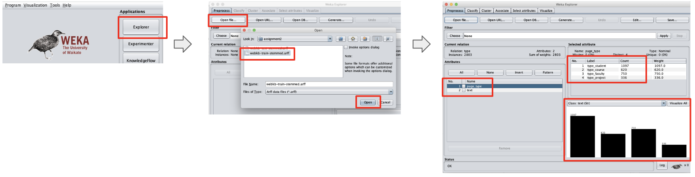

# Assignment 2

Document classification using [Weka](https://www.cs.waikato.ac.nz/ml/weka/).

## Report summary

TODO: summarize the report contents and results

## Assignment details

> Use Naïve Bayes and SVM in Weka to conduct text classification and return
> the classification accuracy.

Input data:

> WebKB containing 2803 training text data and 1396 test data. This data set
> contains WWW-pages collected from computer science departments of various
> universities. These web pages are classified into 4 categories: student,
> faculty, project, and course. The data set has been preprocessed with
> removing stop words and stemming. So you only need to count the word
> frequency to generate a document-word matrix before you start classification.

## Step 1 - Preparing and inspecting the data

In this step we will:

1. Prepare the datasets to use it in Weka.
1. Load the datasets and inspect them.

### Preprocessing the data

The goal of the preprocessing step is to transform the data from its current
format to a format that the tool expects.

In this case we need to transform the space-separated text file into an
[ARFF](https://www.cs.waikato.ac.nz/ml/weka/arff.html) file.

Below is an example of the input file. Each line represents a document. The
first word in each line is the document class, followed by tab, then followed
by the document. The document is already tokenized and stemmed, each word
separated by a space. Stop words have already been removed.

TODO: add link to an overview of how to prepare a document - perhaps in appendix to not break the flow?

```
student	brian comput scienc depart ... advisor david wood tabl content  ...
faculty	russel ... california san diego jolla offic appli physic mathemat ...
```

The transformed file looks like this:

```
@relation type

@attribute page_type {type_student,type_course,type_faculty,type_project}
@attribute text String

@data
type_student, 'brian comput scienc depart ... advisor david wood tabl ...'
type_faculty, 'russel ... california san diego jolla offic appli physic ...'
```

The notable features of the new format are:

1. A header that specifies the format of the lines. In this case the format of
   each line is the class, followed by the document.
2. Each document is still a line, but the class and the content of the document
   are separated from each other, as different attributes (the document is in
   single quotes).

Note that the attribute starts with the prefix `type_`. This was done because
Weka's classifiers (at least some of them) expect the attribute name to be
unique, i.e. to not appear as part of the document itself.

This is the error that Weka shows if we don't add the `type_` prefix:

TODO: add example of this error.

Although Weka has is capable of transforming data, we decided to transform the
data using a Python script. The python script is shown in [this appendix
section](#python-script-for-text-to-arff-transformation).

To execute the script:

    python3 toarff.py input-file.txt > output-file.arff

At this point we should have two ARFF files, one for the train dataset and one
for the test data set, ready to load in Weka.

### Inspecting the train dataset

#### Loading the train dataset and checking class representations

In this section we will inspect the train dataset using Weka. The goals are to
have a general understanding of the datset and to check if there are problems
with that could affect training and evaluation.

A possible problem is class imbalance within each dataset (train and test) and
across them. Ideally the classes should be balanced within and across the
datasets.

To load and inspect in Weka:

1. Choose the Explorer option
2. Open the train dataset



In the picture above we can see that the dataset is unbalanced. The `student`
class has more samples than the other classes. This does not mean there is
something wrong with the dataset, it may be the nature of the underlying
data. We just have to be aware of it and be prepared to deal with it.

In this case we should expect to have more students since they outnumber
faculty in real life by an order of magnitude or more.

Note that at this point the data shows only two pieces of data, the class and
the text. All words from the document are under "text". In the next step we
will parse the document to extract words.

#### Parsing the train dataset

In this step we will split the text into its individual tokes using Weka's
`StringToWordVector` filter. Besides parsing the document into tokens, it will
create the document-word matrix that classifiers need.

This step is a continuation of the step above. At this point the file must be
already loaded. We will add the filter and apply it to that file.

To apply filter:

1. Choose the `StringToWordVector` filter
1. Apply it


With the filter apply we can now see the words in the document. Weka also
updates the number of attributes in the dataset.

### Inspecting the test dataset

In this step we will repeat what was done for the train data (above), now with
the test data.

#### Loading the test dataset and checking class representations

#### Parsing the test dataset

### Analyzing the data

The class frequency in the train and test data **\_\_\_\_**

### Creating the document-word matrix

## Step 2 - Classifying

### Classifying with the Naive Bayes classifier

### Classifying with the SVM classifier

## Step 3 - Fine-tuning the classifiers

In this section we will attempt to improve the performance of the classifiers
by fine-tuning applicable parameters.

An important concept in this section: all fine-tuning exercises are done on the
training data, using cross-validation to check the improvements. We must not
use the test data to for fine-tuning.

### Choosing words to keep

A key attribute of `StringToWordVector` is `-W`, the number of words to keep.

In [this discussion in Weka's forum](http://weka.8497.n7.nabble.com/StringToWordVector-W-option-td940.html)
it is explained that the number of words is kept per class:

> Additionally, if a class attribute is set, then you get the
> most common words per class, i.e. top 1000 for class A, plus top 1000
> for class B, and so on. Furthermore, in case of ties all words with the
> same count are included, which means that usually you will end up with
> 1000odd attributes, instead of exactly 1000

Since the corpus in this exercise is not large and we have a class definition,
it appears that 1,000 words per class (as explained above) would suffice.

To verify that we will double the number of words to keep and try the
classifiers again.

TODO: pic setting the words to keep

### Selecting attributes

TODO: select attributes with AttributeSelection - DO NOT use test data, must
use cross-validation at this stage.

See note in https://stackoverflow.com/questions/19192823/words-to-keep-attribute-in-stringtowordvector-filter-in-weka
that attribute selection should be used for supervised problem - which is the case here.

## Step 4 - Reporting the fine-tuned classifier

TODO: final results using test data

## Apendix

### Python script for text to ARFF transformation

TODO: add Python script here.
