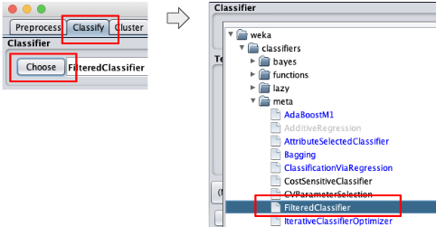
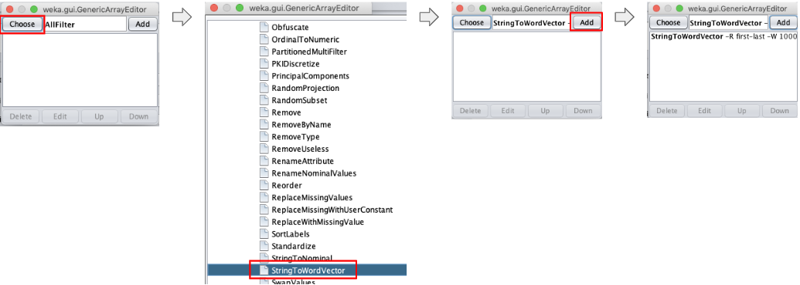
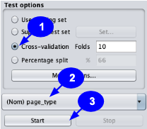

# Assignment 2

CTO-6930 Natural Language Processing, Spring 2019
Assignment 2
Christian Garbin

Document classification using [Weka](https://www.cs.waikato.ac.nz/ml/weka/).

## Assignment details

> Use Naïve Bayes and SVM in Weka to conduct text classification and return
> the classification accuracy.

Input data:

> WebKB containing 2803 training text data and 1396 test data. This data set
> contains WWW-pages collected from computer science departments of various
> universities. These web pages are classified into 4 categories: student,
> faculty, project, and course. The data set has been preprocessed with
> removing stop words and stemming. So you only need to count the word
> frequency to generate a document-word matrix before you start classification.

## Report summary

### Datasets preprocessing and inspection

Datasets for the assignment were provided in the form of two space-separated
files, one with train data and another with test dataset.

Although Weka could read and transform this format, we chose to prepare the
data with a Python script. The script converts the files into Weka's ARFF
format. Having the data in ARFF format simplifies some of the steps in Weka.

Details of preprocessing are described in [step 1](h#step-1---preprocessing-the-data).

[Step 2](h#step-2---inspecting-the-train-dataset) inspects the datasets and
[step 3](#step-3---creating-the-train-dataset-document-word-matrix) shows how
to create document-word (or document-term) matrix for the train dataset in Weka.

### Results for the Naive Bayes classifier

The Naives Bayes classifier was trained with a combination of parameters.

The best performing classifier used `StringToWordVector` with `outputWordCounts`
set to `True` and `wordsToKeep` set to 2000, followed by the attribute selection
filter `AttributeSelection`.

This classifer achieved 85.34% accuracy in the training phase (with cross-
validation) and 84.24% when validate with the test set.

Details to configure and fine-tune the Naive Bayes classifier are described in
[step 4](#step-4---classifying-and-fine-tuning-with-a-naive-bayes-classifier).

### Results for the SVM classifier

The SVM classifier was also trained with a combination of parameters.

The best performing classifier used `StringToWordVector` with `outputWordCounts`
set to `True`, `wordsToKeep` set to 2000. Using tf-idf, by setting
`IDFTransform` and `TFTransform` to `True` was needed to get the best
accuracy for this classifier. Attribute selection, with the `AttributeSelection`
filter was also needed.

This classifier achieved 84.2% in the training phase (with cross-validation)
and 85.5% when validated with the test set.

Details to configure and fine-tune the SVM classifier are described in
[step 5](#step-5---classifying-and-fine-tuning-with-an-svm-classifier).

## Step 1 - Preprocessing the data

The goal of the preprocessing step is to transform the data from its current
format to a format that the classification/analysis tool expects.

In this case we need to transform the space-separated text file into an
[ARFF](https://www.cs.waikato.ac.nz/ml/weka/arff.html) file.

Below is an example of the input file. Each line represents a document. The
first word in each line is the document class, followed by tab, then followed
by the document. The document is already tokenized and stemmed, each word
separated by a space. Stop words have already been removed.

    student	brian comput scienc depart ... advisor david wood tabl content  ...
    faculty	russel ... california san diego jolla offic appli physic mathemat ...

The transformed file looks like this:

    @relation type

    @attribute page_type {type_student,type_course,type_faculty,type_project}
    @attribute text String

    @data
    type_student, 'brian comput scienc depart ... advisor david wood tabl ...'
    type_faculty, 'russel ... california san diego jolla offic appli physic ...'

The notable features of the new format are:

1. A header that specifies the format of the lines. In this case the format of
   each line is the class, followed by the document.
2. Each document is still a line, but the class and the content of the document
   are separated from each other, as different attributes (the document is in
   single quotes).

Note that the attribute starts with the prefix `type_`. This was done because
Weka's classifiers (at least some of them) expect the attribute name to be
unique, i.e. to not appear as part of the document itself.

Although Weka is capable of transforming data, we decided to transform the
data using [a Python script](./toarff.py), mainly because of familiarity with
Python and how easy it is to perform these text transformations using it.

To execute the script:

    python3 toarff.py input-file.txt > output-file.arff

Run the script in the train and test dataset files.

At this point we should have two ARFF files, one for the train dataset and one
for the test data set, ready to load in Weka.

## Step 2 - Inspecting the datasets

### Inspecting the train dataset

In this section we will inspect the train dataset using Weka. The goals are to
have a general understanding of the datset and to check if there are problems
with that could affect training and evaluation.

A possible problem is class imbalance. Within a dataset each class should be
as frequent as they are in the real data. For example, if class A is twice as
frequent as class B in the real data, then the train and test data set should
have twice as many samples of A than B. Across the datasets the class should
have the same frequency. For example, if class A occurss twice as frequently
as other classes in the train dataset, it should also occur twice as
frequenlty in the test dataset. This is taken care of by balancing classes
within the datasets.

To load and inspect in Weka:

1. Choose the Explorer option
2. Open the train dataset

In the picture above we can see that the dataset is imbalanced. The `student`
class has more samples than the other classes. In this case we should expect
to have more students since they outnumber faculty in real life by an order of
magnitude or more. This imbalance within the dataset is not a problem in this
case.

Note that at this point the data shows only two pieces of data, the class and
the text. All words from the document are under "text". In a later step we
will parse the document to extract words.

### Inspecting the test dataset

In this step we will repeat what was done for the train data (above), now with
the test data.

Follow the same steps to start the Explorer and open the test dataset file.

As in the train dataset, the test dataset is also imbalanced, but it is also
expected, for the same reasons discussed for the train dataset.

### Analyzing the datasets

The imbalance within each dataset is not a concern in this case. The classes
are imbalanced within each dataset because of the nature of the data. A
university has more students than any other class, likely by an order of
magnitude.

More important is a possible imbalance across the datasets. The train and test
datasets must have the same proportion of classes or the accuracy tests will
not give a true measure of the model's accuracy with real-life data.

Checking the proportion of classes across the datasets:

| Train dataset   | Test dataset   |
| --------------- | -------------- |
| 1097/2083 = 39% | 544/1396 = 39% |
| 620/2083 = 22%  | 310/1396 = 22% |
| 750/2083 = 27%  | 374/1396 = 27% |
| 336/2083 = 12%  | 168/1396 = 12% |

The table shows that classes are equally represented in the train and test
datasets. Therefore we have a representative test dataset, one that will give
us confidence in the model evaluation.

## Step 3 - Creating the train dataset document-word matrix

The document-word matrix ([or document-term matrix](https://en.wikipedia.org/wiki/Document-term_matrix))
shows the frequency of words in each document (in our example, the frequency of
words in each line, since each line represents a document).

To create the matrix we need to:

1. Load the dataset
1. Apply the `StringToWordVector` filter with the `outputWordCounts` parameter
   set to `True`

Starting with loading the dataset.

Now that the dataset is loaded we apply the `StringToWordVector` filter with
the attribute `outputWordCounts` set to `True`. When this attribute is not set
we get a binary value (present/not present) only.

First we set the filter.

After we configure the parameters we need and apply the filter. To configure
the filter, click anywhere in the white textbox with the filter name and its
parameters to bring up the configuration window for that filter. Once
configured, click on `Apply`.

**IMPORTANT:** Weka applies a filter on the current state of the dataset. If
you apply a filter, then change its configuration and apply it again, it will
not apply to the original dataset. It will apply on top of the results from the
last filter used. If you want to apply to the original dataset, either reload
the dataset or press the `Undo` button until the dataset is restored to its
original state.

Weka creates the matrix once the document is parsed. To see the table, press
the `Edit` button. The numbers are the count of words in each document (each
line of the test file in our case).

## Step 4 - Classifying and fine-tuning with a Naive Bayes classifier

Before starting the fine-tuning process we will review two concepts that guide
that process.

### Preserving the test dataset

An **important optimization concept**: all fine-tuning exercises are verified
with cross-validation to check the improvements (or a validation set, but we
do not have one in this case, so we fall back to cross-validation).

We must not use the test data for fine-tuning. It must be used only for the
final validation of the tuned model. "Otherwise, the very real danger is that
you may tune your hyperparameters to work well on the test set, but if you were
to deploy your model you could see a significantly reduced performance."
([source](http://cs231n.github.io/classification/#val) - see more details in
that page).

### Splitting the train dataset before creating document-term matrices

Although we created a document-term matrix as a separate step above, using the
`Preprocess` tab, when fine-tuning a classifier with cross-validation we need
to apply the filters as part of the classification process itself, not as a
separate step in the process.

With cross-validation we split the train set into a train fold and a validation
fold, train the classifier with the train fold, then check the results on the
validation fold. These steps are repeated for the number of folds we chose.

If we apply the filter as a separate preprocess step, the train/validate
process looks like this:

The separate preprocess step creates one document-term matrix from the complete
train dataset. Once we split it into the train and validation folds, the train
fold contains information on the complete train dataset, including information
that will be part of the validation fold when we split the dataset for cross-
validation. In other words, the classifier can "peek" into the validation data
during training.

The result is a validation step that produces optimistic results. The
classifier will look good during validation, but only because it was able to
access too much information. When testing with the actual test dataset it will
not perform as well.

What kind of information are we sharing that we should not? Any information
that is created using the entire dataset. The typical example is tf-idf. It
uses the number of documents as part of its formula.

In other cases, when we do not use the entire dataset for calculations, we may
get away with creating the document-term matrix with the complete train
dataset. However, starting with splitting the train dataset first, then
creating the separate document-term matrix is a better practice that will
avoid errors down the road, as we run more experiments.

Applying filter and classification together looks like the picture below. The
major difference is that first we split the original dataset into a train and a
validation fold, then create the document-term matrix for each of them
separately. Now the classifier only "sees" data that are part of the train
fold.

### Classifying with a Naive Bayes classifier

We will use a multinomial naive Bayes classifier because it "is the event
model typically used for document classification, with events representing the
occurrence of a word in a single document" ([source](https://en.wikipedia.org/wiki/Naive_Bayes_classifier#Multinomial_naive_Bayes)).

As explained in the previous section, we will split the train dataset before
we create the document-term matrix. To do that we need to apply the
`StringToWordVector` filter before the classifier, using Weka's meta-classifier
`FilteredClassifier` in the `Classify` tab.

Click on any part of the `Classifier` textbox to bring up the configuration
window. It has a field for `classifier` and a field for `filter`. Choose the
`NaiveBayesMultinomial` for `classifier` and `StringToWordVector` for `filter`.
Then click anywhere in `StringToWordVector` textbox to brig up its
configuration window and choose `True` for `outputWordCounts`.

Now we are ready to start the classification and cross-validation. Back in
`Classify` tab:

1. Select cross-validation.
1. Select the `type` field (called `page_type` in Weka) as the attribute to
   classify on.
1. Click on the `Start` button.

This will result in about 82.7% accuracy.

    Correctly Classified Instances        2317               82.6614 %
    Incorrectly Classified Instances       486               17.3386 %

From the confusion matrix we can see where the classifier is making mistakes:

       a   b   c   d   <-- classified as
     991  16  62  28 |   a = type_student
      12 576  16  16 |   b = type_course
     174   8 499  69 |   c = type_faculty
      49   8  28 251 |   d = type_project

The `faculty` class is a source of several errors. A significant amount of its
documents are being classified as `student`.

### Fine-tuning a Naive Bayes classifier

In this section we will attempt to improve the performance of the classifiers
by fine-tuning applicable parameters.

We still keep using cross-validation in this stage, not the test dataset, as
explain [in this section](#preserving-the-test-dataset).

#### Choosing words to keep

A key attribute of `StringToWordVector` filter is `-W`, the number of words to
keep.

In [this discussion in Weka's forum](http://weka.8497.n7.nabble.com/StringToWordVector-W-option-td940.html)
it is explained that the number of words is kept per class.

> Additionally, if a class attribute is set, then you get the
> most common words per class, i.e. top 1000 for class A, plus top 1000
> for class B, and so on. Furthermore, in case of ties all words with the
> same count are included, which means that usually you will end up with
> 1000odd attributes, instead of exactly 1000

Since the corpus in this exercise is not large and we have a class definition,
it appears that 1,000 words per class (as explained above) would suffice. To
verify that we will double the number of words to keep and try the
classifiers again.

First we will change the filter, then run the classifier again.

Click on the `FilteredClassifier` textbox, then on the `StringToWordVector`
textbox, change `wordsToKeep` to 2000, click `OK` to save the changes.

With the new filter is applied we can run the classifier again. Verify that it
is configured correctly, then click on `Start` to run the classifier.

It improved, but not by much.

    Correctly Classified Instances        2325               82.9468 %
    Incorrectly Classified Instances       478               17.0532 %

The confusion matrix shows that accuracy for each class (true positive)
improved, except for a decline in the `project` class.

       a   b   c   d   <-- classified as
     994  14  61  28 |   a = type_student
      12 579  15  14 |   b = type_course
     165  10 506  69 |   c = type_faculty
      46   7  37 246 |   d = type_project

Although it was not a large improvement, it is an improvement nevertheless, so
we will keep using 2000 words.

#### Selecting attributes

Out of all 2000 attributes (words in the documents) we now have selected, some
carry more information than others, i.e. they are more predictive than others.

We will use Weka's attribute selection feature to find these attributes and use
them to attempt to improve the classifier.

To add attribute selection we have to chain filters. First we need the
`StringToWordVector` used so far, then another filter to perform attribute
selection. Chaining filters in Weka is done with `MultiFilter`.

First we change the current filter to `MultiFilter`.

`MultiFilter` shows an `AllFilter` by default. We do not need it. Let's delete
it.

Now we add the filters, in the order we need them to be executed. The first
filter we need is the `StringToWordVector` to tokenize the document.

After tokenization we add `AttributeSelection`.

The final step is to change `StringToWordVector` to use word counts and to keep
2000 words, as we did in the previous steps, then close the multifilter window
by pressing on its X button (it doesn't have an `OK` or `Close`button).

With the multifilter in place we can run the classifier again.

This time it will take considerably longer because of the extra step to perform
attribute selection.

It results in significantly better accuracy:

    Correctly Classified Instances        2392               85.3371 %
    Incorrectly Classified Instances       411               14.6629 %

Inspecting the confusion matrix shows that the accuracy improvement is a
result of a large improvement for the `faculty` class, while making all other
classes slightly worse.

This is the confusion matrix with attribute selection (what we just did):

       a   b   c   d   <-- classified as
     972  19  68  38 |   a = type_student
      36 567  11   6 |   b = type_course
      78  12 627  33 |   c = type_faculty
      62   5  43 226 |   d = type_project

And this is the one from the section above:

       a   b   c   d   <-- classified as
     994  14  61  28 |   a = type_student
      12 579  15  14 |   b = type_course
     165  10 506  69 |   c = type_faculty
      46   7  37 246 |   d = type_project

### Using tf-idf

So far we have been using only data within each document (the document-term
populated with word counts).

In [tf-idf](https://en.wikipedia.org/wiki/Tf%E2%80%93idf) the _idf_ term, the
inverse document frequency, is calculated as _log(total number of
documents/number of documents with the term)_. This brings information across
all the documents into consideration.

In this test we check it using tf-idf improves the classifier. First we need
to switch to tf-idf by setting `IDFTransform` and `TFTransform` in the
`StringToWordVector` filter.

Click anywhere in the `Classifier` textbox (where it shows
`FilteredClassifier...`) to open the configuration window, then navigate to
the `StringToWordVector` filter and set `IDFTransform` and `TFTransform` and
to `True`.

Then run the classifier again.

Accuracy decreases somewhat:

    Correctly Classified Instances        2370               84.5523 %
    Incorrectly Classified Instances       433               15.4477 %

### Summary of the naive Bayes classifier fine tunning

A summary of the fine-tuning attempts:

| Attempt | `wordsToKeep` | Attribute selection | tf-idf | Cross-validation accuracy (%) |
| ------- | ------------- | ------------------- | ------ | ----------------------------- |
| 1       | 1000          | No                  | No     | 82.66                         |
| 2       | 2000          | No                  | No     | 82.95                         |
| 3       | 2000          | Yes                 | No     | 85.34                         |
| 4       | 2000          | Yes                 | Yes    | 84.55                         |

Since we are using overall accuracy as the deciding factor, we will use the
classifier from attempt number 3 as the best classifier resulting from the
fine-tuning process.

The next step is to check the performance of that classifier in unseen data,
using the test dataset.

Before going into the test dataset evaluation remove tf-idf by resetting
`IDFTransform` and `TFTransform` back to `False`.

### Verifying the naive Bayes classifier on the test set

Once we are done with fine-tuning we need to check how classifier number 3
behaves on unseen data. That is an indication of how well (or not) it will
perform in real life.

This is where the test dataset comes in. It has been held back so far, to have
a dataset that the classifer has never seen before.

To evaluate with a test dataset change the test options to `Supplied test set`,
load the dataset and configure the class attribute (the same we are using for
training, the `type` attribute, or `page_type` in Weka).

Once it is configured, verify that the test options are set correctly (and that
`IDFTransform` and `TFTransform` are reset to `False`), then start the test.

The result is a classification accuracy very close to the one achieved during
training. Therefore we can say that the classifier generalizes well.

    Correctly Classified Instances        1176               84.2407 %
    Incorrectly Classified Instances       220               15.7593 %

The confusion matrix shows that it behaves about the same as during the
training phase (a good thing in this case).

       a   b   c   d   <-- classified as
     469  10  47  18 |   a = type_student
      19 274   5  12 |   b = type_course
      38   5 310  21 |   c = type_faculty
      24   3  18 123 |   d = type_project

Comparing the other metrics also confirms that the classifier generalized well.

These are the metrics with the test dataset:

                     TP Rate  FP Rate  Precision  Recall   F-Measure  MCC      ROC Area  PRC Area  Class
                     0.862    0.095    0.853      0.862    0.857      0.766    0.952     0.914     type_student
                     0.884    0.017    0.938      0.884    0.910      0.886    0.982     0.960     type_course
                     0.829    0.068    0.816      0.829    0.822      0.757    0.938     0.890     type_faculty
                     0.732    0.042    0.707      0.732    0.719      0.680    0.948     0.727     type_project
    Weighted Avg.    0.842    0.064    0.844      0.842    0.843      0.780    0.954     0.895

And these are the metrics for the training phase, with cross-validation:

                     TP Rate  FP Rate  Precision  Recall   F-Measure  MCC      ROC Area  PRC Area  Class
                     0.886    0.103    0.847      0.886    0.866      0.777    0.951     0.915     type_student
                     0.915    0.016    0.940      0.915    0.927      0.907    0.985     0.963     type_course
                     0.836    0.059    0.837      0.836    0.837      0.777    0.940     0.885     type_faculty
                     0.673    0.031    0.746      0.673    0.707      0.671    0.932     0.733     type_project
    Weighted Avg.    0.853    0.064    0.853      0.853    0.853      0.793    0.953     0.896

## Step 5 - Classifying and fine-tuning with an SVM classifier

In this section we will use the `libsvm` classifier in Weka. Another flavor of
the SVM classifier, called `SMO`, is also available in Weka. Since the
assignment asked for `SVM` in general, we will stick with the regular SVM
classifier here.

The same concepts of [preserving the test dataset](#preserving-the-test-dataset)
and [splitting the train dataset before creating document-term matrices](#splitting-the-train-dataset-before-creating-document-term-matrices)
discussed in the naive Bayes classifier section apply to the SVM classifier as
well.

### Installing the SVM classifier

The SVM classifiers are part of a separate package in Weka, not installed by
default. To install the SVM classifiers, open the package manager (under the
`Tools` menu), search for `libsvm`, click on the `LibSVM` entry and install it.

(Side note: this section switches from the red rectangles to numbered arrows to
indicate relevant UI pieces. The numbered arrows indicate the order of the
steps, which the red rectangles do not. I didn't have this brilliant idea until
I reached this point in the work...)

### Classifying with the SVM classifier

As explained in [this section](#splitting-the-train-dataset-before-creating-document-term-matrices),
we will split the train dataset before we create the document-term matrix. To
do that we need to apply the `StringToWordVector` filter before the classifier,
using Weka's meta-classifier `FilteredClassifer` in the `Classify` tab.

Once `FilteredClassifier` is in place we need to configure its classifier and
filter.

Starting with the classifier: change it to `libSVM`.

Then change the filter to `StringToWordVector` (under the "unsupervised" list)
and close the configuration window.

Configure the test options to use cross-validation with the type field
(`page_type`) in Weka and start the classification.

This results in 73.4% accuracy.

    Correctly Classified Instances        2057               73.3857 %
    Incorrectly Classified Instances       746               26.6143 %

From the confusion matrix we can see that other than the `student` class, all
other classes fair poorly.

        a    b    c    d   <-- classified as
     1078    4   14    1 |    a = type_student
      149  465    5    1 |    b = type_course
      260    3  486    1 |    c = type_faculty
      250    1   57   28 |    d = type_project

### Fine-tuning an SVM classifier

#### Using word counts

The default configuration of `StringToWordVector` creates a binary document-term
matrix (tracks of the words is present or absent, but not how many times it is
present in a document).

As a first attempt to improve the classifier we will change `StringToWordVector`
to count words. The idea is to give more information to the classifier.

Change `outputWordCounts` to `True` and save the configuration.

Verify the test configuration and run the classifier again.

That change improves the accuracy by about 3%.

    Correctly Classified Instances        2133               76.097  %
    Incorrectly Classified Instances       670               23.903  %

Most of that improvement comes from the `project` class.

        a    b    c    d   <-- classified as
     1050    4   34    9 |    a = type_student
      123  478   14    5 |    b = type_course
      260    9  466   15 |    c = type_faculty
      134   12   51  139 |    d = type_project

#### Using more words

Since using word counts improved the classifier, now we will try to use more
words. The default configuration of `StringToWordVector` keeps 1000 words per
class (see note [in this section](#choosing-words-to-keep) that this is an
approximate number).

Change `wordsToKepp` to 2000 and save the configuration.

Verify the test configuration and run the classifier again.

Keeping more words resulted in lower accuracy:

    Correctly Classified Instances        1916               68.3553 %
    Incorrectly Classified Instances       887               31.6447 %

#### Using fewer words

Since adding more words lowered accuracy, we will go in the opposite direction
now. Repeat the procedure above, this time reducing `wordsToKeep` to 500, and
run the classifier again.

Keeping 500 words improves the classifier by a significant amount:

    Correctly Classified Instances        2298               81.9836 %
    Incorrectly Classified Instances       505               18.0164 %

The `student` class is slightly worse, but all other classes are better.

        a    b    c    d   <-- classified as
     1044   10   32   11 |    a = type_student
       85  519   10    6 |    b = type_course
      157   17  555   21 |    c = type_faculty
      108   14   34  180 |    d = type_project

#### Selecting attributes

Since reducing the number of attributes improved the classifier, we will
attempt to reduce the attributes even further. But this time we will use
attribute selection to pick the attributes to keep.

Follow the steps [in the naive Bayes section](#selecting-attributes) to add the
attribute selection filter, then run the classifier again.

This time it will take longer to run, because of the attribute selection step.

The accuracy with attribute selection improves a bit more:

    Correctly Classified Instances        2339               83.4463 %
    Incorrectly Classified Instances       464               16.5537 %

Not all classes improved equally. `course` and `faculty` are better, but
`student` and `project` decreased somewhat.

        a    b    c    d   <-- classified as
     1017   10   55   15 |    a = type_student
       70  539    7    4 |    b = type_course
      105    9  615   21 |    c = type_faculty
      118    2   48  168 |    d = type_project

### Using tf-idf

As we did for the naive Bayes classifier, we will check if tf-idf improves the
performance of the SVM classifier.

Follow the steps [in the naive Bayes section](#using-tf-idf) to change
`StringToWordVector` to use tf-idf, then run the classifier again.

Accuracy improves a bit more:

    Correctly Classified Instances        2360               84.1955 %
    Incorrectly Classified Instances       443               15.8045 %

And except for a small decrease in the `project` class, every class improved.

        a    b    c    d   <-- classified as
     1024   15   45   13 |    a = type_student
       56  551    5    8 |    b = type_course
       97   11  624   18 |    c = type_faculty
      132    3   40  161 |    d = type_project

### Summary of the SVM classifier fine tunning

A summary of the fine-tuning attempts:

| Attempt | `wordsToKeep` | `outputWordCounts` | Attribute selection | tf-idf | Cross-validation accuracy (%) |
| ------- | ------------- | ------------------ | ------------------- | ------ | ----------------------------- |
| 1       | 1000          | No                 | No                  | No     | 73.39                         |
| 2       | 1000          | Yes                | No                  | No     | 76.10                         |
| 3       | 2000          | Yes                | No                  | No     | 68.36                         |
| 4       | 500           | Yes                | No                  | No     | 81.98                         |
| 5       | 500           | Yes                | Yes                 | No     | 83.45                         |
| 6       | 500           | Yes                | Yes                 | Yes    | 84.20                         |

Classifier number 6, with attribute selection and td-idf, has the best accuracy.
We will use it for the final validation with the test set.

### Verifying the SVM classifier on the test set

Once we are done with fine-tuning we need to check how classifier number 6
behaves on unseen data. That is an indication of how well (or not) it will
perform in real life.

This is where the test dataset comes in. It has been held back so far, to have
a dataset that the classifer has never seen before.

To evaluate with a test dataset change the test options to `Supplied test set`,
load the dataset and configure the class attribute (the same we are using for
training, the `type` attribute, or `page_type` in Weka).

The accuracy on the test dataset is close to the accuracy we got with the train
dataset. Therefore we can conclude that the classifier generalizes well.

    Correctly Classified Instances        1193               85.4585 %
    Incorrectly Classified Instances       203               14.5415 %

These are the detailed accuracy values for the test dataset:

                     TP Rate  FP Rate  Precision  Recall   F-Measure  MCC      ROC Area  PRC Area  Class
                     0.934    0.151    0.797      0.934    0.860      0.766    0.891     0.771     type_student
                     0.884    0.006    0.979      0.884    0.929      0.912    0.939     0.891     type_course
                     0.837    0.044    0.874      0.837    0.855      0.804    0.896     0.775     type_faculty
                     0.583    0.019    0.810      0.583    0.678      0.653    0.782     0.523     type_project
    Weighted Avg.    0.855    0.074    0.860      0.855    0.852      0.795    0.890     0.769

And these are the detailed accuracy metrics with cross-validation:

                     TP Rate  FP Rate  Precision  Recall   F-Measure  MCC      ROC Area  PRC Area  Class
                     0.933    0.167    0.782      0.933    0.851      0.750    0.883     0.756     type_student
                     0.889    0.013    0.950      0.889    0.918      0.897    0.938     0.869     type_course
                     0.832    0.044    0.874      0.832    0.852      0.801    0.894     0.772     type_faculty
                     0.479    0.016    0.805      0.479    0.601      0.585    0.732     0.448     type_project
    Weighted Avg.    0.842    0.082    0.847      0.842    0.836      0.776    0.880     0.748
