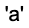
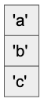
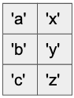
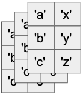

# TensorFlow introduction for natural language processing

This is a simple introduction to TensorFlow, with emphasis in natural language
processing (NLP) applications.

It is divided in two parts:

1. What TensorFlow is
1. Applying TensorFlow to natural language process (NLP)

This introduction has a companion slide deck [in this file](<./COT-6930 presentation TensorFlow.pdf>).

## What is TensorFlow?

### What is a tensor?

_Tensor_ is a n-dimensional data structure, where `n` can be any number greater
than or equal to zero. The number of dimensions is the _rank_ of the tensor.

Some examples of tensors:

| Rank 0                                       | Rank 1                                       | Rank 2                                       | Rank n                                       |
| -------------------------------------------- | -------------------------------------------- | -------------------------------------------- | -------------------------------------------- |
| 0D tensor                                    | 1D tensor                                    | 2D tensor                                    | nD Tensor                                    |
| Scalar                                       | Vector                                       | Matrix                                       | Tensor                                       |
|  |  |  |  |
