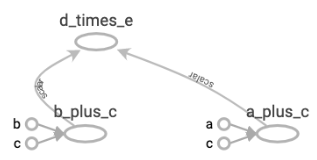
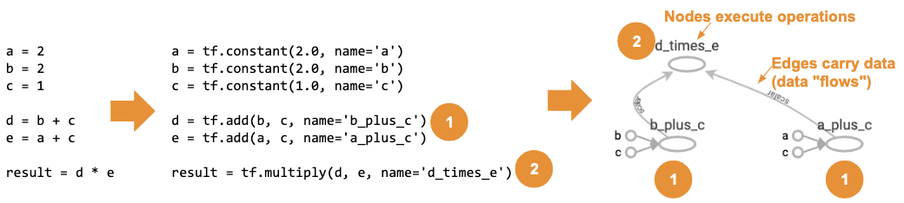
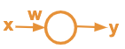
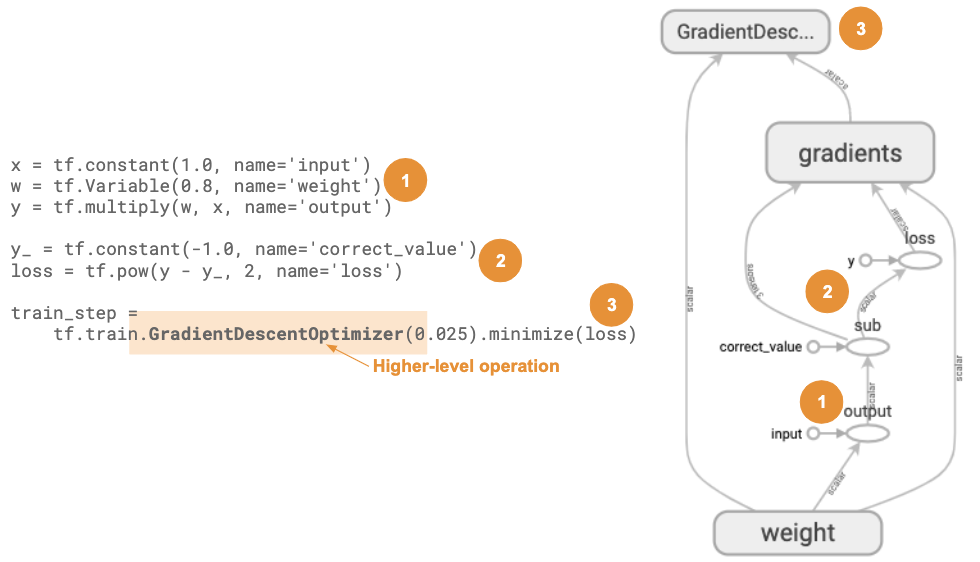
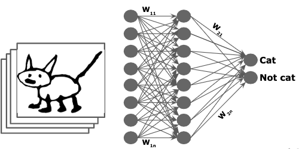
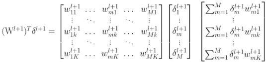

# TensorFlow introduction for natural language processing

This is a simple introduction to TensorFlow, with emphasis in natural language
processing (NLP) applications.

It is divided in two parts:

1. What TensorFlow is
1. Applying TensorFlow to natural language process (NLP)

This introduction has a companion slide deck [in this file](<./COT-6930 presentation - TensorFlow.pdf>).

## TensorFlow introduction

### What is a tensor?

_Tensor_ is a n-dimensional data structure, where `n` can be any number greater
than or equal to zero. The number of dimensions is the _rank_ of the tensor.

Examples of tensors:

| Rank 0                                       | Rank 1                                       | Rank 2                                       | Rank n                                       |
| -------------------------------------------- | -------------------------------------------- | -------------------------------------------- | -------------------------------------------- |
| 0D tensor                                    | 1D tensor                                    | 2D tensor                                    | nD Tensor                                    |
| Scalar                                       | Vector                                       | Matrix                                       | Tensor                                       |
|  |  |  |  |

### What is TensorFlow?

TensorFlow is a generic, high-performance computation engine.

#### Graphs

TensorFlow represents computations as graphs.

For example, this computation:

    a = 2
    b = 2
    c = 1

    d = b + c
    e = a + c

    result = d * e

Is represented in TensorFlow as:

    a = tf.constant(2.0, name='a')
    b = tf.constant(2.0, name='b')
    c = tf.constant(1.0, name='c')

    d = tf.add(b, c, name='b_plus_c')
    e = tf.add(a, c, name='a_plus_c')

    result = tf.multiply(d, e, name='d_times_e')

Which results in this graph:

The nodes are the computations to be performed and the edges is where data (the
tensors) flows from one edge to another (and now we have the pieces for the
name: _TensorFlow_).

Putting it all together: the computation, the TensorFlow equivalent and its
graph showing the nodes (computations) and edges (where data flows from one
node to the next):

#### Why use graphs

Why go through the trouble of transforming computations from simple code to the
more complex graph representation?

Representing computations as graphs allows TensorFlow to:

1. Package them in higher-level, reusable operations.
1. Distribute them efficiently for parallel execution.
1. Reuse them in different environments.

To illustrate that, let's see a another example. In this graph we create a
simplified artificial neuron, with an input `x`, weight `w` and output `y`
(technically, it's missing a non-linearity after the output to be neuron - it's
simplified for illustration).

This neuron is the sole member of a neural "network" that needs to output the
correct value `-1`.

We will create a graph that trains the network to find a value for the weight
`w` that results in the correct output when the input is `1`. To do that we
will use a [gradient descent](https://en.wikipedia.org/wiki/Gradient_descent)
optimizer.

The picture below shows the TensorFlow code and the graph it creates. With a
few lines of code we are able to reuse an entire optimization operation, the
`GradientDescentOptimzer`. It is a prepackaged graph, ready to be reused.

That illustrates reusing packaged components, but it's a very small network.

#### The need for high-performance computation

Neural networks in real life are much larger. The typical neural network has
several layers, each composed of hundreds or thousands of neurons.

The internal representation of a neural network, what the computer "sees", is
a series of large tensors. Training such a network and making predictions with
it require billions of operations on those large tensors.

This is where _high performance_ comes in. TensorFlow is able to detect the
best hardware available on a computer (GPUs or TPUs) or grid of computers and
parallelize as many operations as possible on that hardware.
