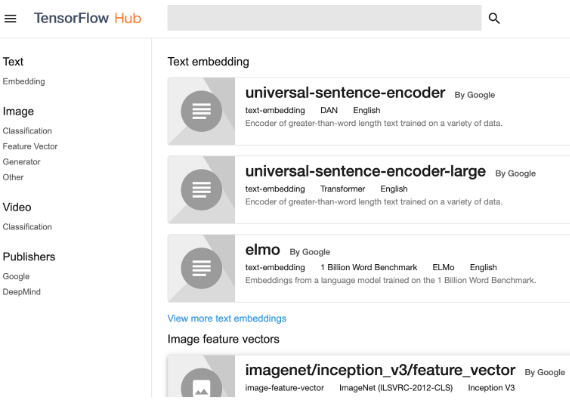
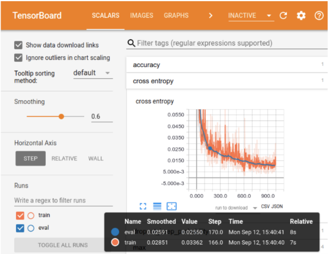
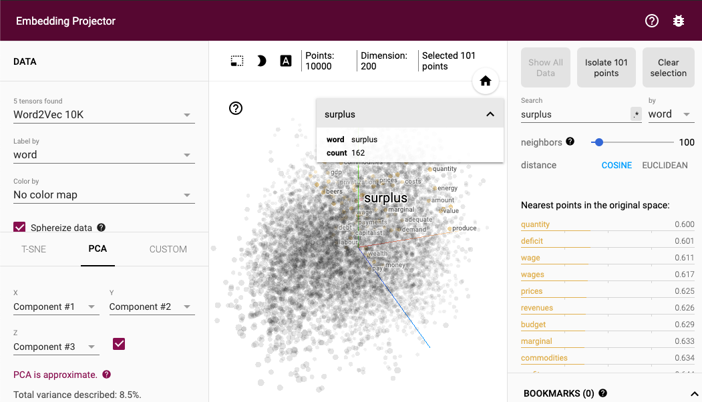
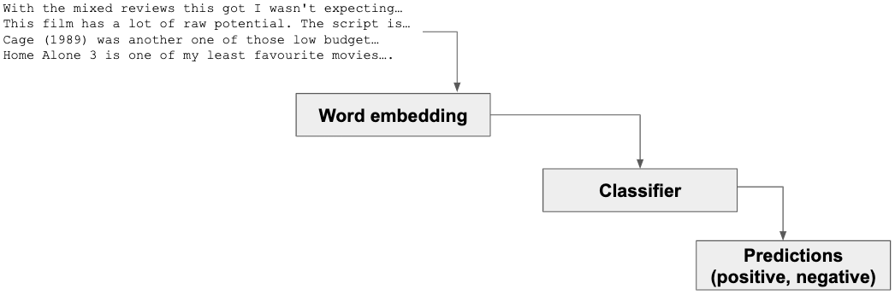
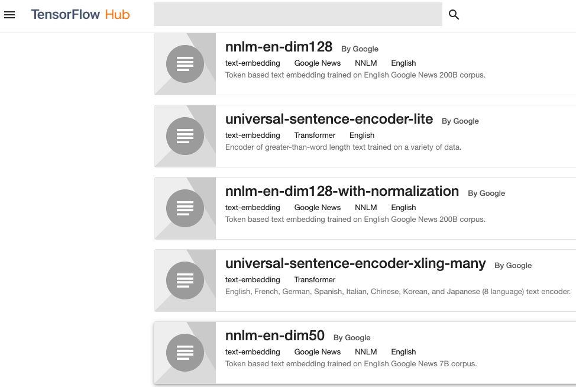
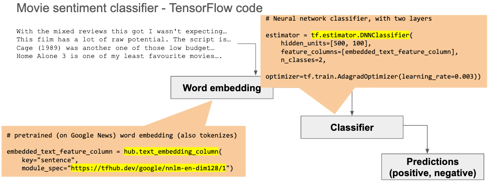

# TensorFlow introduction for natural language processing

This is a simple introduction to TensorFlow, with emphasis in natural language
processing (NLP) applications.

It is divided in two parts:

1. What TensorFlow is
1. Applying TensorFlow to natural language process (NLP)

This introduction has a companion slide deck [in this file](<./COT-6930 presentation - TensorFlow.pdf>).

## TensorFlow introduction

### What is a tensor?

_Tensor_ is a n-dimensional data structure, where `n` can be any number greater
than or equal to zero. The number of dimensions is the _rank_ of the tensor.

Examples of tensors:

| Rank 0                                       | Rank 1                                       | Rank 2                                       | Rank n                                       |
| -------------------------------------------- | -------------------------------------------- | -------------------------------------------- | -------------------------------------------- |
| 0D tensor                                    | 1D tensor                                    | 2D tensor                                    | nD Tensor                                    |
| Scalar                                       | Vector                                       | Matrix                                       | Tensor                                       |
|  |  |  |  |

### What is TensorFlow?

TensorFlow is a generic, high-performance computation engine.

#### Graphs

TensorFlow represents computations as graphs.

For example, this computation:

    a = 2
    b = 2
    c = 1

    d = b + c
    e = a + c

    result = d * e

Is represented in TensorFlow as:

    a = tf.constant(2.0, name='a')
    b = tf.constant(2.0, name='b')
    c = tf.constant(1.0, name='c')

    d = tf.add(b, c, name='b_plus_c')
    e = tf.add(a, c, name='a_plus_c')

    result = tf.multiply(d, e, name='d_times_e')

Which results in this graph:

The nodes are the computations to be performed and the edges is where data (the
tensors) flows from one edge to another (and now we have the pieces for the
name: _TensorFlow_).

Putting it all together: the computation, the TensorFlow equivalent and its
graph showing the nodes (computations) and edges (where data flows from one
node to the next):

#### Why use graphs

Why go through the trouble of transforming computations from simple code to the
more complex graph representation?

Representing computations as graphs allows TensorFlow to:

1. Package them in higher-level, reusable operations.
1. Distribute them efficiently for parallel execution.
1. Reuse them in different environments.

To illustrate that, let's see a another example. In this graph we create a
simplified artificial neuron, with an input `x`, weight `w` and output `y`
(technically, it's missing a non-linearity after the output to be neuron - it's
simplified for illustration).

This neuron is the sole member of a neural "network" that needs to output the
correct value `-1`.

We will create a graph that trains the network to find a value for the weight
`w` that results in the correct output when the input is `1`. To do that we
will use a [gradient descent](https://en.wikipedia.org/wiki/Gradient_descent)
optimizer.

The picture below shows the TensorFlow code and the graph it creates. With a
few lines of code we are able to reuse an entire optimization operation, the
`GradientDescentOptimzer`. It is a prepackaged graph, ready to be reused.

That illustrates reusing packaged components, but it's a very small network.

#### The need for high-performance computation

Neural networks in real life are much larger. The typical neural network has
several layers, each composed of hundreds or thousands of neurons.

The internal representation of a neural network, what the computer "sees", is
a series of large tensors. Training such a network and making predictions with
it require billions of operations on those large tensors.

This is where _high performance_ comes in. TensorFlow is able to detect the
best hardware available on a computer (GPUs or TPUs) or grid of computers and
[distribute operations on that grid](https://www.tensorflow.org/guide/distribute_strategy).

### TensorFlow is more than a library

If "all" that TensorFlow delivered was a high-performance computation library,
it would already be a remarkable achievement.

However, it is more than that. TensorFlow has other components that make it
even more useful:

-   Repository of reusable modules: [TensorFlow Hub](https://www.tensorflow.org/hub).
-   Debugging and visualization tools: [TensorBoard](https://www.tensorflow.org/guide/summaries_and_tensorboard).
-   Deployment models: TensorFlow for regular computers, [TensorFlow.js](https://www.tensorflow.org/js)
    to run inside a browser, and [TensorFlow Lite](https://www.tensorflow.org/lite)
    to run on low(er)-powered device (mobile devices, edge devices, etc.)

#### Reusable modules

[TensorFlow Hub](https://www.tensorflow.org/hub) is a collection of reusable
module. Some of these modules are from Google, trained on their immense amount
of data.

The reusable modules are a good starting point for machine learning research
and development. Start with one of them as a baseline and fine tune for your
specific task.

#### Debugging and visualization

Developing a machine learning module is in many ways similar to writing code.
The main difference is that data play a much more prominent role. Other than
that, we still need to understand how a model behaves during training and how
different [hyperparameters](<https://en.wikipedia.org/wiki/Hyperparameter_(machine_learning)>)
affect a model.

[TensorBoard](https://www.tensorflow.org/guide/summaries_and_tensorboard) is
the visual debugging tool for TensorFlow. It allows us to inspect the details
of the training and prediction process, as well as perform ["what if?"](https://ai.googleblog.com/2018/09/the-what-if-tool-code-free-probing-of.html)
analysis.

#### Deployment models

Running a network in different environments, e.g. a server in a data center,
inside a browser, on low-powered device such as smartphones, requires
adapation to the neural network and to the engine itself.

TensorFlow offers deployment models optimized for different environments.

-   [TensorFlow](https://www.tensorflow.org/) makes the best use of servers.
-   [TensorFlow.js](https://www.tensorflow.org/js) is optimized for applications
    that use JavaScript on a server ([Node.js](https://nodejs.org/en/)), or
    inside a browser, where it makes use of WebGL to accelerate models.
-   [TensorFlow Lite](https://www.tensorflow.org/lite) runs on low-powered
    devices, with limited computing and memory.

### Putting it all together

[TensorFlow](https://www.tensorflow.org/) is

-   ...a generic computation engine that supports highly-parallelized execution
    on specialized hard (GPU, TPU, computer grids)
-   ...adapted to run on diverse environments ([TensorFlow](https://www.tensorflow.org/),
    [TensorFlow.js](https://www.tensorflow.org/js),
    [TensorFlow Lite](https://www.tensorflow.org/lite)).
-   ...backed by a collection of reusable modules ([TensorFlow Hub](https://www.tensorflow.org/hub))
    and a visulization/debugging tool ([TensorBoard](https://www.tensorflow.org/guide/summaries_and_tensorboard)).

## TensorFlow and natural language processing (NLP)

Natural language processing in TensorFlow is available at different levels.

At the lower levels it has basic utility functions for
[tokenization](https://www.tensorflow.org/datasets/api_docs/python/tfds/features/text/Tokenizer),
[vocabulary creation](https://www.tensorflow.org/tfx/transform/api_docs/python/tft/compute_and_apply_vocabulary),
[n-grams](https://www.tensorflow.org/tfx/transform/api_docs/python/tft/ngrams),
and [tf-idf](https://www.tensorflow.org/tfx/transform/api_docs/python/tft/tfidf),
among others.

At the higher levels of language processing, TensorFlow has support for
[word and sentence embedding](https://www.tensorflow.org/guide/embedding) and
[recurrent neural networks, such as LTSM](https://www.tensorflow.org/tutorials/sequences/recurrent).

Because embedding is an important part of natural language processsing,
TensorFlow has a powerful [embedding projector](https://projector.tensorflow.org/),
to help visualize and debug word and sentence embeddings.

### Example using movie review sentiment analysis

This example is based on TensorFlow's [text classification tutorial](https://www.tensorflow.org/hub/tutorials/text_classification_with_tf_hub).
The goal is to classify a movie review as _positive_ or _negative_.

In this example we will use these pieces of TensorFlow to build a moview review
sentiment analysis.

-   A pretrained word embedding from TensorFlow Hub, which also takes care of
    tokenization.
-   A classifier module.
-   An optmizer module.

Before going into the code, let's review a classifier at a high level: we need
to extract features from the reviews (using word embedding in this case),
then we need to train a classifier with a training dataset and after that we
can use the trained classifier to make predictions on unseen data (the test
dataset).

Starting with feature extraction: TensorFlow Hub has
[pretrained word embedding modules](https://tfhub.dev/s?module-type=text-embedding),
several of them trained on Google's own very large vocabulary. For this example
we will use `nnlm-en-dim128-with-normalization`.

Once we have the feature extraction step in place, we need to build a
classifier. We will use a neural network classifier, which means we also need
to choose an optimizer for the network. TensorFlow has several modules ready
to be used. We will use `DNNClassifier` and `AdagradOptimizer`.

Piecing it all together, the code looks like this:

    # ... read the movie data

    # Extract features with a pretrained word embedding (also tokenizes)
    embedded_text_feature_column = hub.text_embedding_column(
        key="sentence",
        module_spec="https://tfhub.dev/google/nnlm-en-dim128/1")

    # Neural network classifier, with two layers
    estimator = tf.estimator.DNNClassifier(
        hidden_units=[500, 100],
        feature_columns=[embedded_text_feature_column],
        n_classes=2,
        optimizer=tf.train.AdagradOptimizer(learning_rate=0.003))

    # Train the classifier
    estimator.train(input_fn=train_input_fn, steps=1000);

    # Verify accuracy on the test data
    test_eval_result = estimator.evaluate(input_fn=predict_test_input_fn)
    print("Test set accuracy: {accuracy}".format(**test_eval_result))

See this [Jupyter notebook in GitHub](https://github.com/cgarbin/cot6930-natural-language-processing/blob/master/tensorflow-presentation/TensorFlowTextClassificationExample.ipynb)
if you want to run the code on your own.

To visualize where the pieces are used, here is the high-level view of the
classification process again, now with the relevant pieces of code in place.

